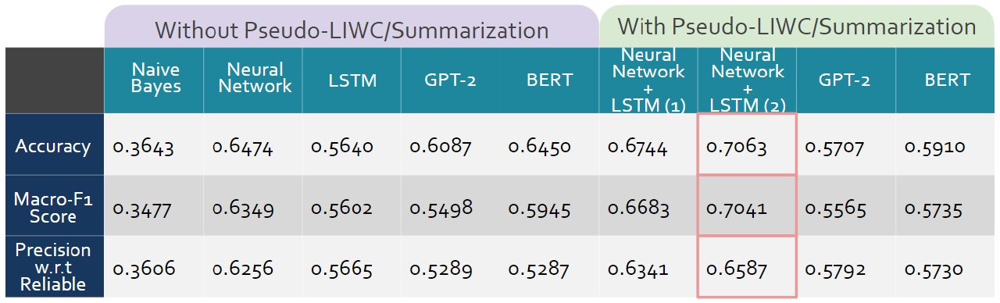

# CS4248-project

### Abstract

Utilizing the Labeled Unreliable News (LUN) dataset, we apply Natural Language Processing (NLP) techniques to classify news articles into four categories: reliable, satire, propaganda, and hoax. Our approach comprises two core components: (1) The development of 'Pseudo-LIWC', an innovative preprocessing methodology that significantly improves the predictive accuracy of various machine learning models; (2) An in-depth comparative analysis across different model architectures to evaluate the underlying reasons for their performance disparities.

### Preprocessing

Our preprocessing innovatively simulates LIWC by applying NLP techniques for sentiment polarity, syntactic subjectivity and etc. The approach filters and tokenizes text, extracts sentiment and grammatical features, and employs Recursive Feature Elimination (RFE) with a Random Forest (RF) classifier to distill the most impactful features. This feature set is then standardized, and fed into neural network which captures the linguistic expressions and indicators embedded in text data. Our pseudo-LIWC preprocessing method, combining NLP techniques and selective feature refinement, has been shown to boost performance across various models.

### Naive Bayes

Uses Naive Bayes. This is one of the baseline methods for comparison.

### tf-idf + NN

This model uses tf-idf vectorizer combined with simple neural network. It is one of the baseline methods for comparison.

### LSTM

The model LSTM does not use our proposed preprocessing methods, instead, just text inputs. It is one of the baseline methods for comparison.

### LSTM1 (Single Model)

The model LSTM1 makes use of features extracted using preprocessing (pseudo-LIWC and RFE) using dense layers, as well as text input using LSTM. It is the same model as the 'Single model' memtioned in our poster.

### LSTM2 (Dual Model)

The model LSTM2 effectively makes use of features extracted using preprocessing (pseudo-LIWC and RFE) using dense layers, as well as text input using LSTM. It is the same model as the 'dual model' memtioned in our poster.

### GPT

There are 2 files for GPT, one for the standard fine-tuning without preprocessing and the other incorporates the features into the final layer. These notebooks were run in Kaggle. The notebooks include the hyperparameters that produced thge best results, but note that some of the cell outputs were from later runs which were not the best. Simply run the cells in sequence to reproduce the output.

### BERT

There is only 1 file for BERT. It includes the training codes of BERT both with and without summarized text. They were run in local machine, with CPU training. To train the BERT model with the code, choose from 3 of the cells for the input data first, and then run the remaining cells in sequence.

### Extractive Summarization

The code used to generate the summarized datasets can be found in the file generate_summarized_datasets.ipynb; simply run each code cell in order, ensuring that the path to the original Labeled Unreliable News dataset is appropriately set. The generated summarized datasets can be found in the summarized_datasets.zip file.

### Results

